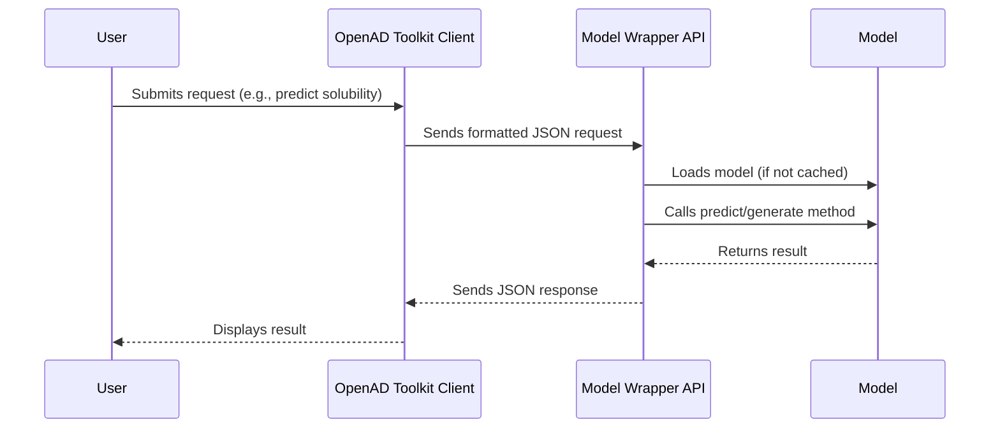
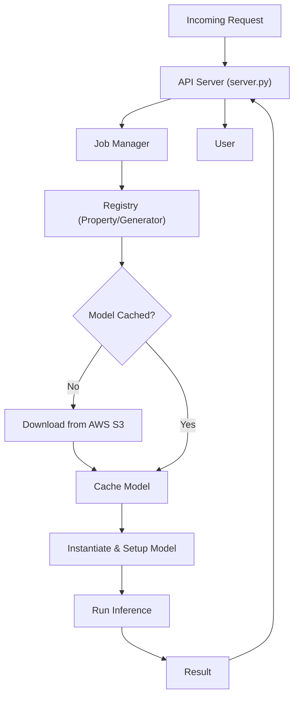

# Model Wrapper Architecture Overview

This document provides an overview of the model wrapper's architecture. The wrapper is designed to be a flexible and extensible platform for serving machine learning models.

Requests are sent to the model wrapper API using a client, such as the [OpenAD Toolkit](https://github.com/acceleratedscience/openad-toolkit).

## User Flow

The following diagram illustrates the typical user flow:

## Code Flow

The following diagram illustrates the code flow within the model wrapper:

## Components

The model wrapper consists of the following key components:

*   **Wrapper API:** The front-facing API that handles incoming requests and routes them to the appropriate model.
*   **Model Loading:** The component responsible for loading models into memory and preparing them for inference.
*   **Generation Modes:** The different modes in which the model can be run, such as prediction, generation, and nested properties.
*   **Inference Pipeline:** The sequence of steps that are executed to perform inference on a given input.
