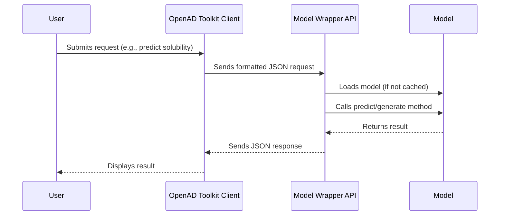
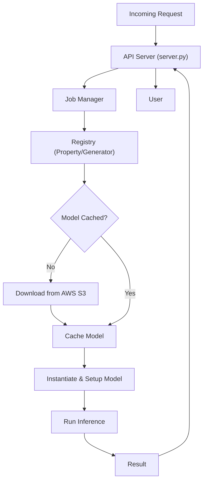

# Model Wrapper Architecture Overview

This document provides an overview of the model wrapper's architecture. The wrapper is designed to be a flexible and extensible platform for serving machine learning models.

Requests are sent to the model wrapper API using a client, such as the [OpenAD Toolkit](https://github.com/acceleratedscience/openad-toolkit).

## User Flow

The following diagram illustrates the typical user flow:

```mermaid
sequenceDiagram
    participant User
    participant OpenAD Toolkit Client
    participant Model Wrapper API
    participant Model

    User->>OpenAD Toolkit Client: Submits request (e.g., predict solubility)
    OpenAD Toolkit Client->>Model Wrapper API: Sends formatted JSON request
    Model Wrapper API->>Model: Loads model (if not cached)
    Model Wrapper API->>Model: Calls predict/generate method
    Model-->>Model Wrapper API: Returns result
    Model Wrapper API-->>OpenAD Toolkit Client: Sends JSON response
    OpenAD Toolkit Client-->>User: Displays result
```

## Code Flow

The following diagram illustrates the code flow within the model wrapper:

```mermaid
graph TD
    A[Incoming Request] --> B["API Server (server.py)"];
    B --> C["Job Manager"];
    C --> D["Registry (Property/Generator)"];
    D --> E{"Model Cached?"};
    E -- No --> F["Download from AWS S3"];
    F --> G["Cache Model"];
    E -- Yes --> G;
    G --> H["Instantiate & Setup Model"];
    H --> I["Run Inference"];
    I --> J[Result];
    J --> B;
    B --> K[User];
```

## Components

The model wrapper consists of the following key components:

*   **Wrapper API:** The front-facing API that handles incoming requests and routes them to the appropriate model.
*   **Model Loading:** The component responsible for loading models into memory and preparing them for inference.
*   **Generation Modes:** The different modes in which the model can be run, such as prediction, generation, and nested properties.
*   **Inference Pipeline:** The sequence of steps that are executed to perform inference on a given input.

## Execution Workflows

The API supports two primary execution workflows: synchronous and asynchronous. Understanding the difference is crucial for building robust and scalable services.

### Synchronous Workflow (Default)

By default, all requests are handled synchronously. This means the client sends a request and waits for the entire process to complete before receiving a response.

*   **How it Works:** The API holds the client's connection open while it processes the request, runs the model's `predict` method, and generates the result.
*   **Result Handling:**
    *   **JSON:** If the result is JSON data, it is returned directly in the response body.
    *   **File:** If the result is a file (returned as a `FileResponse`), the file is streamed back directly as a download.
*   **Use Case:** Ideal for quick predictions that take less than 30-60 seconds.
*   **Limitation:** For long-running tasks (e.g., complex simulations, large file generation), the client's connection can time out. This can lead to a `503 Service Unavailable` error, even if the process eventually completes on the server. The client is left unaware of the final status.

### Asynchronous Workflow

The asynchronous workflow is designed specifically to handle long-running tasks reliably. It decouples the initial request from the final result.

*   **How it Works:** The client sends a request with `"async": true`. The server immediately accepts the request, creates a job, and returns a `job_id`. The client's connection is then closed. The job continues to run in the background.
*   **Result Handling:** The client must use the `job_id` to poll the `get_result` endpoint to check the job's status. Once the job is complete:
    *   **JSON:** The status response will contain the final JSON result.
    *   **File:** The status response will contain a `download_url` pointing to a new `/service/download/{job_id}` endpoint, which can then be used to download the file.
*   **Use Case:** Essential for any task that may exceed the standard HTTP timeout, ensuring that the client can reliably retrieve the result, no matter how long it takes to generate.
